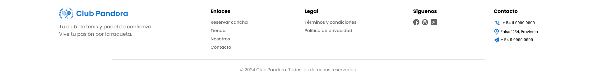
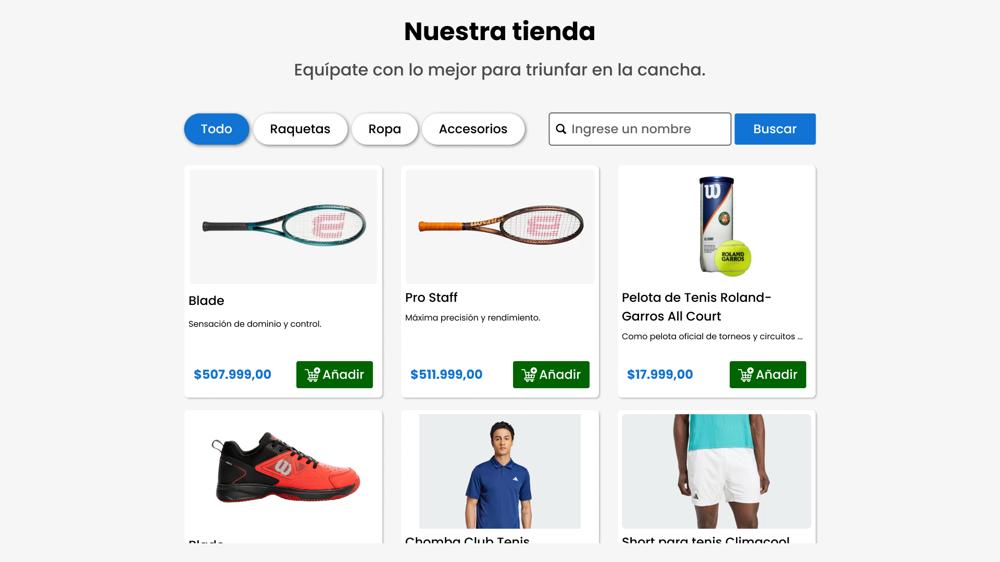
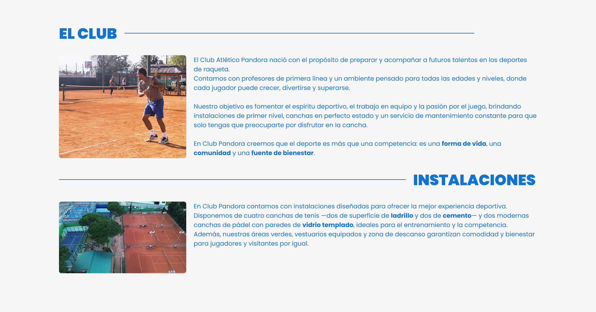
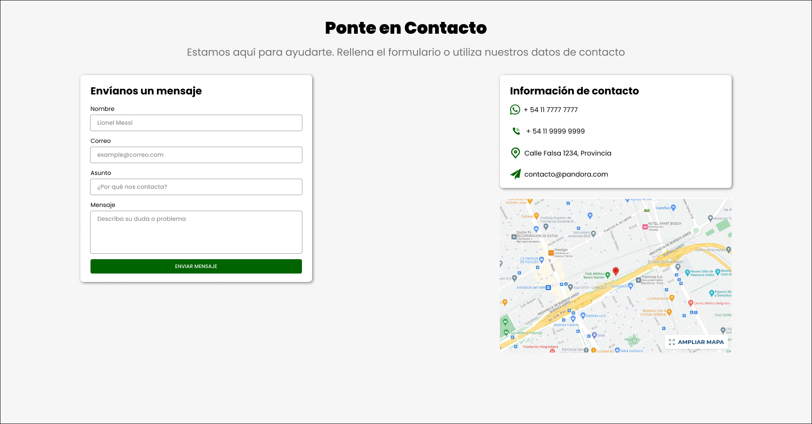

# Proyecto Club Pandora

## Desarrollado por:
- Tomás Graziano
- Juan Cruz

## Configurar Apache XAMPP
- El XAMPP debe apuntar a la carpeta `app` de este proyecto.

Mueva la carpeta `app` a la carpeta `htdocs` de XAMPP.

Correr el apache de xampp e ingresar a <a href="http://localhost/app">http://localhost/app</a> y debe ver el contenido de index.php

## Configurar la base de datos

- Debe levantar en XAMPP el servicio de MySQL

Una vez levantado ingresar a phpMyAdmin en <a href="http://localhost/phpmyadmin">http://localhost/phpmyadmin</a>

## Diseño de la web
[Figma](https://www.figma.com/design/cajz06OLDe2FE3qQKLjtKu/Club-Pandora?node-id=0-1&p=f)

### Cabecera

### Footer

### Home

### Sobre nosotros

### Contacto

